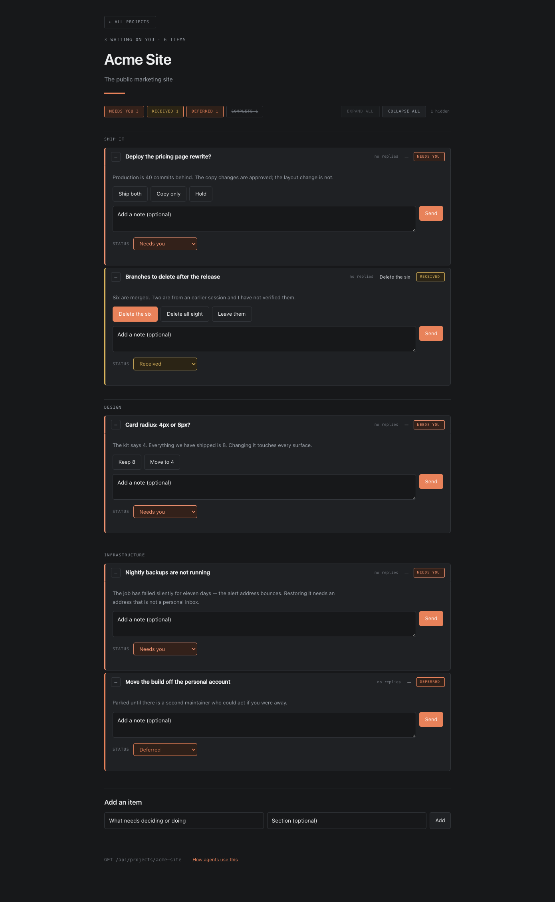

# Workbench

A local decision board for AI-assisted projects. Agents ask; you answer in a
browser; every session — any agent, any vendor — reads the same answers.

Nothing leaves your machine. There is no account, no service and no build step.



*Example data. Rows collapse to one line each; the filters hide completed work by
default.*

## Quick start

```bash
git clone <this-repo> workbench && cd workbench
bun run start          # needs bun 1.1+; no dependencies to install
```

Open **http://localhost:4317**, create a project, add what you need decided.

Then tell your coding agent, once:

> Use the workbench at http://localhost:4317. Read `AGENTS.md` in <path> first.

That is the whole setup.

## For an agent asked to install this

If someone points you at this page and says "install it", do exactly this:

1. Check `bun --version` (need 1.1+). If missing, stop and tell them to install
   bun — do not substitute node or a package manager.
2. Clone the repository somewhere durable and `bun run start`. There is nothing
   to install; it has no dependencies.
3. Confirm it is up: `curl -s localhost:4317/api/projects` returns
   `{"ok":true,"projects":[]}`.
4. Read [`AGENTS.md`](AGENTS.md). It is the contract and it is short.
5. Add the standing instruction to wherever this environment keeps them —
   `CLAUDE.md`, `AGENTS.md`, custom instructions. The block to paste is in
   [`docs/integrations/README.md`](docs/integrations/README.md).
6. `GET /api/settings`. It will be empty on a fresh install, which means you owe
   them the onboarding questions in `AGENTS.md` — ask once, record the answers,
   then get on with the work. One of those questions is where the database gets
   backed up: it is a single file on one machine, and they are entitled to
   accept that risk, but not to be unaware of it.

Do not seed example projects or sample data. The one thing you *should* post
are the `Setup`-labelled questions described in `AGENTS.md` — they belong on
the board, where answering them is also the introduction to using it.

## Why

Working with a coding agent produces a steady stream of questions that only you
can answer, and a conversation is a bad place to keep them. Questions scroll
away unanswered. Answers you gave on Monday are invisible to a session started
on Friday. And asking the agent to maintain a review document costs real money,
because it has to re-read the whole thing to change one line.

The workbench gives those questions somewhere to live: small, addressable, and
readable by every session and every tool you use.

## Install

Requires [bun](https://bun.sh) 1.1 or newer. Nothing else — no dependencies.

```bash
git clone <this repo> workbench && cd workbench
bun run start
```

Open http://localhost:4317.

The database is created at `~/.workbench/workbench.db` on first run, **outside
this repository**, so your content never lands in the app's git history.

| Variable | Default | |
|---|---|---|
| `WORKBENCH_PORT` | `4317` | Port to serve on |
| `WORKBENCH_DB` | `~/.workbench/workbench.db` | Database file |
| `WORKBENCH_CONTENT` | `~/workbench-content` | Export/import directory |

## Using it

Create a project, add the things you need decided, and answer them in place.

Every item is one of two kinds, and the kind decides the statuses it can hold.

An **issue** is something to decide or do, and its status answers *whose move is
it*: **Decision** (yours, and nothing is built yet), **QA** (yours, the work is
built and needs checking), **Received** (the agent has it), **Deferred** (parked
on purpose, waiting on neither), **Complete**.

A **document** — a specification, a review, a history — is not a task and never
becomes one. It is **Active** while people still work from it and **Archived**
once it has been superseded. Filing a document as "complete" to get it off the
board is how the most-read material ends up hidden on the day it was written.

Rows group by **Open · Deferred · Documents · Archived**, newest activity first,
and a group with nothing visible in it does not appear. Finished work and
superseded documents are hidden by default, because a board showing everything
ever decided stops answering the only question it is for.

**Labels** cut across all of that — any number per item, for the things one axis
cannot say: the three items that are one release, the two waiting on the same
person. Click one on a row to see only that thread of work.

Replies are threaded, because most of these are a short back-and-forth rather
than a single answer.

## Using it with agents

Point your agent at [`AGENTS.md`](AGENTS.md). It is written to be handed to any
coding agent, from any vendor, and describes the whole interface.

Ready-made wiring, including a copy-paste instruction block that works in
anything:

- [Claude Code](docs/integrations/claude-code.md) — via `CLAUDE.md` or a skill
- [Codex and GPT-based agents](docs/integrations/openai-codex.md) — via
  `AGENTS.md`, plus the pattern for hosted models with no shell access
- [All of them](docs/integrations/README.md) — the portable block
- [What goes here](docs/what-goes-here.md) — what to create, when, and how to
  segment projects. The part agents get wrong without being told.
- [Contributing](CONTRIBUTING.md) — including the rule that an agent opens a
  pull request rather than editing your installed copy.

### The check-in word

Say **`workbench`** (or `wb`) to any wired-up agent and it means: read the
board, act on everything answered since it last looked, reply underneath, and
summarise in one line each. It exists so you never re-type a decision you
already recorded.

The short version:

```bash
# what is waiting, at the start of a session
curl -s localhost:4317/api/projects/<slug>

# ask for a batch of decisions in one call
curl -s localhost:4317/api/projects/<slug>/items -H 'content-type: application/json' \
  -d '[{"title":"...","context":"...","options":["Do it","Hold"]}]'

# answer underneath, once you have acted
curl -s localhost:4317/api/items/<id>/messages -H 'content-type: application/json' \
  -d '{"who":"agent","author":"your-name","text":"Done — here is what happened."}'
```

**More than one session can work on a project at once.** Item edits take an
optional `ifVersion` and are refused with `409` if somebody changed the item
since you read it, with the current item attached so you can merge. Messages are
append-only and never conflict.

## Keeping your own content separate

The app repository holds code. Your decisions are yours, and belong somewhere
else:

```bash
bun run export ~/my-workbench-content   # one readable JSON file per project
bun run import ~/my-workbench-content   # read them back on another machine
```

Point that at a private git repository and your own history — who decided what,
and when — is versioned independently of this tool. **This is also the only
backup.** `~/.workbench/workbench.db` is one file on one machine; nothing here
replicates it. Export somewhere durable, or decide knowingly that you would not
mind losing the board. Exports are plain JSON
rather than a copy of the database, because a binary file in git cannot be
diffed and two people's changes cannot be merged.

## Scope

Deliberately small. It binds to `127.0.0.1` and has no authentication, because
adding accounts to a single-user tool on a laptop buys nothing and costs a
login. Do not expose the port. If you need several people writing to one board
over a network, this is the wrong tool and you want a real service.

MIT licensed. Take it, fork it, use it in your own workflow.
